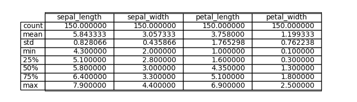

# pands-project  

**by Grainne Boyle**

I work at [TE Connectivity] .
I am a student at the [Atlantic Technological University](https://www.atu.ie/), Galway, studying the Higher Diploma in Science in Data Analytics on a part-time basis over 2 years.  
This repository contains the files for the project for the Programme and Scripting module in the Higher Diploma in Science in Data Analytics.

## Contents

1. [Description](#Description)
2. [Background](#Background)
3. [Script](#Script)
4. [Preprocessing](#Preprocessing)
5. [Discussion](#Discussion)
6. [Conclusion](#Conclusion)
7. [References](#Refences)
8. [Libraries](#Libraries)
9. [Requirements](#Requirements)

## Description  
This project is based on the [Iris Data Set](https://en.wikipedia.org/wiki/Iris_flower_data_set). For the project I must research the data set and write documentation and code in Python to investigate the data set, with a view to explaining it to my colleagues.I may be asked to give a presentation on the data , where I explain what investigating a data set entails and how Python can be used to do it. 

## Background  
The Fisher’s Iris data set  is a multivariate data set made famous by the statistician and biologist Ronald Fisher in his 1936 paper 'The use of multiple measurements in taxonomic problems as an example of linear discriminant analysis(find a linear combination of features that characterises or separates two or more classes) . It is sometimes called Anderson’s Iris data set because Edgar Anderson collected the data to quantify the morphologic variation of Iris flowers of three related species. Two of the three species were collected in the Gaspe peninsula,  "all from the same pasture, and picked on the same day and measured at the same time by the same person with the same apparatus"

The data set consist of 50 samples from each of three species of Iris, the Iris setosa, Iris virginica and Iris versicolor . Four features were measured from each sample: the length and the width of the sepals and petals, in centimeters. 

In the image, you can see a description of the Iris and the types of petals and sepals that were measured. To help to distinguish them, sepals are often green and leaf-like but in the Iris they are colourful. Sepals are modified leaves that form the outer whorl of a flower and are the first part of a flower to form. Their function is to protect the developing flower and keep it from drying out. The petals are upright and colorful, they are the parts of a flower that are often conspicuously colored.

In the following image, we look at the three species in more details:  

Setosa has 3 pairs of petals, 3 large sepals, known as the 'falls' and 3 inner, much smaller petals known as the 'standards'.   
Virginica has 3 drooping sepals, called "falls",  and 3 upright petals, called "standards".  
Versicolor has 6 petals and bluntly sepals spread out nearly flat.   
 

## Script 
Python language used in this script is a simple high-level and an open-source language used for general-purpose programming.  
The script is run from the command line by entering python analysis.py   
It imports a number of libraries to enable analysis of the dataset.  
It runs a number of commands and codes.  
It saves a summary of the variables to the same folder as the script.  
It generates a number of tables and graphs that I use to analyse the data set.  

## Analysis.py Script Detail
* Read in the Iris Data CSV from a URL.  
* Imports libraries needed to run script.  
* Preprocesses the data to ensure it is suitable for analysis by describing the data, checking data types and checking for null values.  
* Outputs description of the data types, variables and missing values to a file in the same repository "iris-summary.txt".   
* Reads in modules from a file within the repository "plots.py", these modules are functions to create the graphs and visualisations.  
* Creates scatterplots of the data and outputs to a png file within the repository.  
* Creates pairplots of the data and outputs to a png file within the repository.  
* Creates facet grids of the dataset.  
* Creates box plot of the dataset.  
* Creates individual histograms for each variable.  
* Calculates the correlation matrix.   
* Creates a heatmap from the correlation data.  
* Creates violin plots.  
* Creates Andrew's curve plot.  
* Saves a table of the describe for import to this Readme.  
* Saves a table of the missing values for import to this Readme.  

## Preprocessing 

The script is run on Python. It is uploaded from a CSV file. First the data is checked for completeness and suitability for analysing.  

We first look at the data types, it shows that the counts of the different species are numerical and species are treated as objects. A count of the values shows that there are  50 of each species.  

This table describes the data, it shows that there are 150 samples counted, it shows the average, minimum , maximum in all the categories.

The data was tested for missing values and this table shows there are no missing values, it is a clean set suitable for analysis.  

## Discussion

*Plot 1 - Box plot*

Box plots show the median, quartile and potential outliers. The plot shows that the distribution varies more significantly on the petal length and petal width. Sepal length and sepal width are shorter in their variation but the sepal length is the longest in length of the four variables. There are outliers mainly on the sepal width.

The histograms are examples of an **univariate analysis** where we look at the each one of the variables individually.

*Plot 2 - Histogram Sepal Length*

The histogram of the sepal length shows there is an overlap on all the species with setosa having the shorter length and virginica having the longer length.

*Plot 3 - Histogram Sepal Width*

The histogram of the sepal width shows an overlap on all the species with setosa having the longer length up to 4.4cm, versicolor mainly the shortest between 2.0cm and 3.5cm and virignica somewhere in between.

*Plot 4 - Histogram Petal Length*

The histogram of the petal length shows less of an overlap between the species. The setosa petals are the shortest between 1cm and 2cm, versicolor range between 3cm and 5.3cm and virginica are the longest between 4.3cm and 7cm. So, it is easier to identify and separate the three species by using petal length.

*Plot 5 - Histogram Petal Width*

The histogram of the petal width shows that setosa is the shortest in cm under 0.5cm, versicolor lies between 1cm and 1.8cm and virginica is between approximately 1.4cm and 2.5cm. Again is it easier to identify the three species by petal length and  petal width rather than the sepal length and sepal width where is is more of an overlap between the three species. 

Next we will look at some **Bivariate Analysis** where two variables are compared.

*Plot 6 - Scatterplot of Sepal length vs Sepal Width*

Each point on the scatterplot refers to one on the 150 iris flowers , with colour and shape indicating their species type. The setosa has the shortest sepal length and the longest sepal width. Virginica has larger sepal length but smaller sepal width. Versicolor lies in the middle of the two with more overlap with versicolor.

*Plot 7 - Scatterplot of Petal length vs Petal Width*

 Setosa stands out on it's own again in this plot. It has shorter petal lengths and widths. There is less of an overlap between the other two species on the petal length. Virginica has the the largest petal lengths and widths. Versicolor lies in the middle of the two other species.

*Plot 8 - Facet grid of Sepal length vs Sepal Width*

The facet grids show individual scatterplots of the three species. I have added a line of best fit and you can see there is a linear regression, generally as the sepal length increases the sepal width also increases.

*Plot 9 - Facet grid  of Petal length vs Petal Width*

This shows clearly the differences and you can easily identify the species by their different petal lengths and widths.

*Plot 10 - HeatMap*

The heatmap shows the correlation between the variables, It ranges from −1 to 1. If the value is close to +1 it implies that if the data points are on a line as the x increases, the y also increases. If the value is close to – 1 , it implies a line where y increases while x decreases. Darker colours show a stronger correlation. Petal width and petal length have a very high correlation. Petal length and sepal length have a high correlation. Sepal length and petal width have a high correlation. Sepal width has a negative correlation with all the other variables.

*Plot 11 - Violin Plots*

Violin plot is a hybrid of the box plot and kernal density plot. The plot displays a clear separation for petal lengths and widths of the three species, particularly for the Iris Setosa. Whereas there is less clear separation between the sepal lengths and widths.

*Plot 12 - Pairplot*

The pairplot could be used to demonstrate **Bivariate** or **Multivariate** analysis. It is a matrix of scatter plots. It shows all the variables plotted against each other. The diagonal plots are the univariate plots. It is useful for a quick analysis of the data. Clearly on this pairplot , we can see that the setosa iris is separate and more clearly identifiable from the other two species. There is a high correlation between the petal length and width columns visible here. 

*Plot 13 - Andrew's Curves*

Andrew's Curves demonstrate a **Multivariate** visualisation. It uses a function to generate curves for visualising clusters or separations. We can interpret the curves by examining the similarities or differences among the shape of the curves. Setosa is distinct from the other two species, there is more of an overlap between virgincia and versicolor. This is similar to what we observed in our other visualisations.

## Conclusion  
 
 * It is a complete dataset.
 * It is much used, due to the few variables making for clear visualisation and proposed by the prominent statician Sir Ronald Fisher
 * Setosa is more distinguishable from the other two species. Setosa has higher sepal width but lower sepal length, petal width and petal length.
 * Virginica has lower sepal width, but higher sepal length, petal width and petal lenghth.
 * Versicolor lies mainly in between the other species in terms of sepal and petal widths and lengths with more of an overlap to the virginica species.
 * All species show linear regression between sepal length and sepal width, and petal length and petal width.
 * All variables show positive correlation to each other apart from sepal width which shows a negative correlation. 

## References  

### Research  
* [Pandas library](https://pypi.org/project/pandas/) - libary for working with data set. It has functions for analysing , cleansing, exploring and manipulating data.  
* [Data Frames](https://www.w3schools.com/r/r_data_frames.asp) - Takes a csv file and loads it into a dataframe, which is like a table with rows and columns.  
* [CSV Files](https://docs.python.org/3/library/csv.html) - enables the file to be read in a tabular form.  
* [Using Numpy](https://numpy.org/doc/stable/user/absolute_beginners.html) - facilitate advanced mathematical and other types of operations on large numbers of data.  
* [Expoloring the dataset](https://www.geeksforgeeks.org/exploratory-data-analysis-on-iris-dataset/)- shows how to describe the data and uses visualisation through plots and ,graphs.  
* [Exploratory Analysis](https://medium.com/@nirajan.acharya666/exploratory-data-analysis-of-iris-dataset-9c0df76771df) - Analysis of the Iris dataset.
* [Geeks for Geeks](https://www.geeksforgeeks.org/python-basics-of-pandas-using-iris-dataset/)- Start off code for Iris dataset and Panda Basic.  
* [Multivariate Statistics](https://en.wikipedia.org/wiki/Multivariate_statistics) - observations of more than one variable  
* [Univariate and Bivariate Analysis](https://www.geeksforgeeks.org/univariate-bivariate-and-multivariate-data-and-its-analysis/) - univariate looks at one variable and bivariate looks at two variables and how thy may be related.  
* [Bivariate Analysis](https://www.questionpro.com/blog/bivariate-analysis/) - looks at the visual methods on how we can measure if two variables are related.  
* [Medium](https://medium.com/geekculture/8-best-seaborn-visualizations-20143a4b3b2f) - different visualisations you can use.  
* [Colour Selection](https://matplotlib.org/mpl_examples/color/named_colors.hires.png).  
* [Colour Heatmap](https://python-graph-gallery.com/92-control-color-in-seaborn-heatmaps/) - selecting colours for the heatmap. 
* [Cloudinary](https://cloudinary.com/guides/web-performance/4-ways-to-add-images-to-github-readme-1-bonus-method#:~:text=The%20easiest%20way%20to%20add,you%20want%20it%20to%20appear.) - Adding images to readme file
* [Medium](https://zion-oladiran.medium.com/exploratory-data-analysis-iris-dataset-68897497b120) - Comparisons to other Iris datasets

### Code Sources 
* [Geeksfor Geeks Histograms](https://www.geeksforgeeks.org/interpretations-of-histogram/) - Interpretations of Histograms.  
* [W3 Schools matplotlib](https://www.w3schools.com/python/matplotlib_pyplot.asp) - how to plot using matplotlib.  
* [W3Schools histograms](https://www.w3schools.com/python/matplotlib_histograms.asp) - how to plot histograms.  
* [Wikipedia Correlation Coefficient](https://en.wikipedia.org/wiki/Pearson_correlation_coefficient) describes the linear relationship between x and y. 
* [Real Python](https://realpython.com/visualizing-python-plt-scatter/)- This articles shows you how to do a scatterplot and how to change shapes and colours.  
* [Facet Grids](https://www.geeksforgeeks.org/python-seaborn-facetgrid-method/) - I seen the idea for the facet grids in some of the research documents , particularly the Rpubs project above and I researched how to do it using geeksforgeeks.  
* [Box plots](https://www.geeksforgeeks.org/box-plot-and-histogram-exploration-on-iris-data/) -graphical representation of the distribution of a dataset.  
* [Pairplots](https://seaborn.pydata.org/generated/seaborn.pairplot.html) - matrix of graphs enables the visualisation of the relationship between each pair os variables in a data set.  
* [Kernal Density Estimate](https://seaborn.pydata.org/generated/seaborn.kdeplot.html) - like a smoother version of a histogram, while kde produces a probability distribution, the height of the curve at each point gives a density not probability.  
* [Disable warnings](https://www.geeksforgeeks.org/how-to-disable-python-warnings/) - This shows how to stop showing warnings that appear for plots etc.  
* [Seaborn](https://seaborn.pydata.org/generated/seaborn.pairplot.html) - This shows pairplots using all the numerical variables.  
* [Seaborn](https://seaborn.pydata.org/generated/seaborn.kdeplot.html) - Explanation and examples of different kernal density plots.  
* [Violin Plots](https://www.geeksforgeeks.org/violin-plot-for-data-analysis/) - Has been described as a hybrid of a box plot and kernal density plot. It can depict summary statistic and density of each variable.  
* [Multiplots](https://www.geeksforgeeks.org/multi-plot-grid-in-seaborn/) - how to do a multiplot for the violinplot.  
* [Real Python](What Does if __name__ == "__main__" Do in Python? – Real Python) - execute code when  file is run from a script, but not when imported as a module.  
* [Pandas Plot multivariate](https://pandas.pydata.org/docs/user_guide/visualization.html#andrews-curves) - example of multivariate plot.  
* [Delftstack](https://www.delftstack.com/howto/python-pandas/pandas-png/) - how to save a table into png.  
* [Geeks for Geeks](https://www.geeksforgeeks.org/how-to-automatically-install-required-packages-from-a-python-script/) - showing what requirements are needed to run a script.  
* [Lag Plots](https://www.ncss.com/wp-content/themes/ncss/pdf/Procedures/NCSS/Lag_Plots.pdf) - Check to see if suitable for Iris dataset. 
* [Real Python](https://realpython.com/python-import/) - Import Modules 
* ChatGPT - This was used to tidy up and make some improvements on a few of the graphs.

## Libraries  

* Pandas - for the DataFrame data structure. It allows us to investigate CSV files . It is a Python library used for working with data sets. It has functions for analyzing, cleaning, exploring, and manipulating data.  
* CSV - (Comma Separated Values) is a simple file format used to store tabular data.  
* NumPy - is a general-purpose array-processing package. It provides a high-performance multidimensional array object, and it facilitates mathematical on large numbers of data.  
* Matplotlib - used for data visualization, typically in the form of plots, graphs and charts.  
* Seaborn library - used for visualizing the explorative statistical plots of data.  
* Warnings - we tell Panda to ignore future warning message generated by Pandas.  

## Requirements

python 3.11.5
matplotlib 3.7.2
numpy 1.24.3
seaborn 0.12.2

